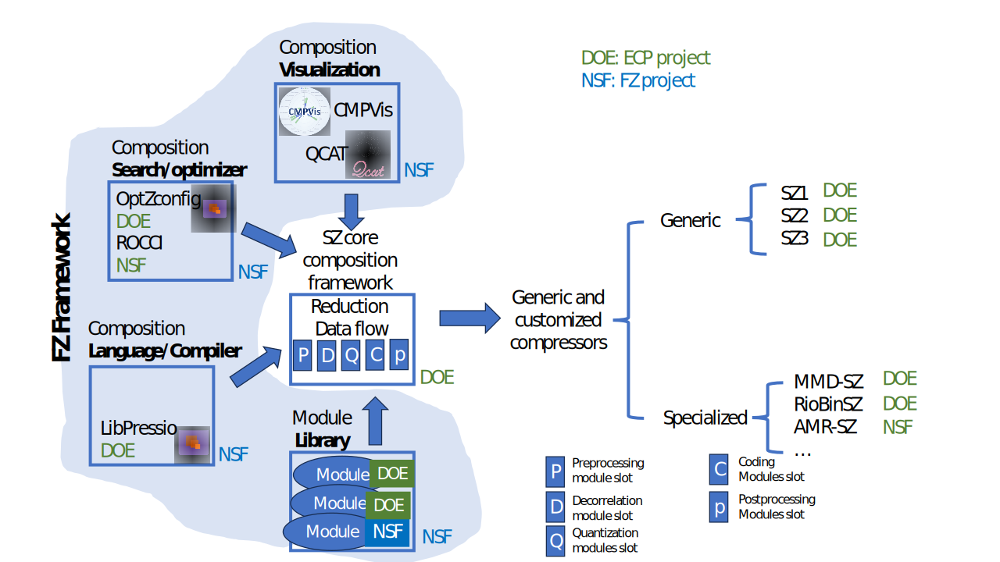



    

        
    

    
This project is partially funded by the National Science Foundation (NSF) CSSI "FZ" project with Grants #2311875, #2311876, #2344717, #2311878.



    <object data="project-diagram.svg" type="image/svg+xml" width="100%" height="720">
        
    </object>

